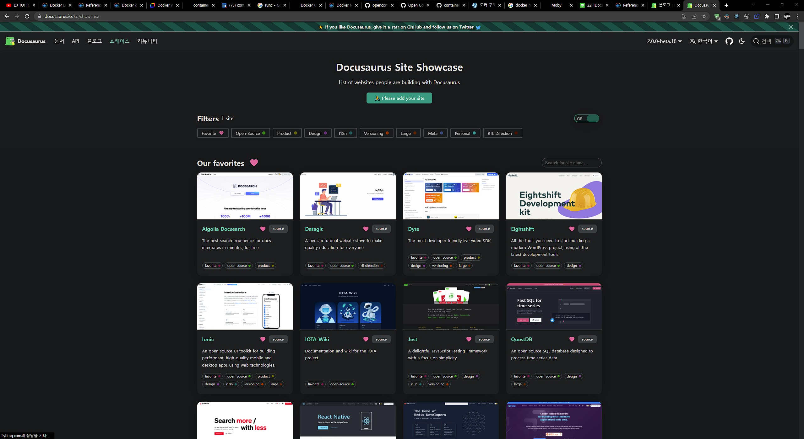

# 첫 글을 싸다

블로그 만들고 첫 글을 싸게 되었다. 항상 예전부터 블로그 써야지, 기술 블로그 만들어야지 하면서도 `티스토리는 이게 안좋고... 지킬은 이게 안좋고...` 하다가 접게 된 게 한 두번이 아니다.

그래서 편하게 마크다운으로 기술할 수 있는 블로그 어디 없나 하다가, Docusaurus 라는 프로젝트를 운좋게 찾아서 써봤다.

> 어? 나쁘지 않은데?

알고보니 create-react-app 이랑 redux 같은 프로젝트에서도 줄기차게 쓰고 있는 거였다.

디자인도 깔끔하고, 마크다운만 있어도 글을 쓸 수 있다는게 어디인가. 그래서 이번에는 이 블로그를 좀 써보려고 한다.
언젠가 또 갈아엎겠지만 일단 양질의 글을 싸놔야 나중에 옮기기 쉬울거라는 기대를 가지고...
